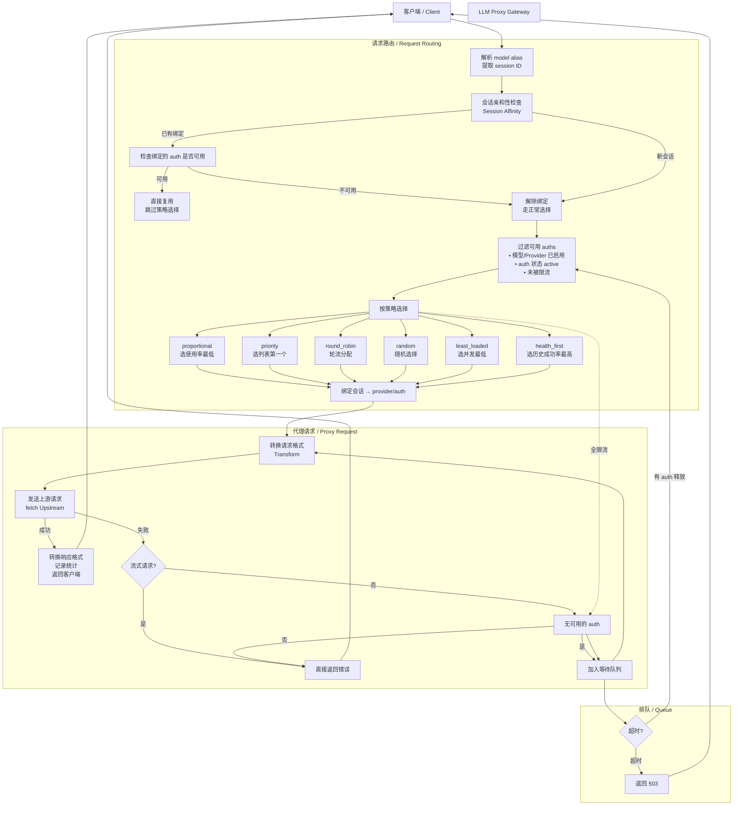

# LLM Proxy Gateway

[](./README.zh.md)

A lightweight local LLM API proxy gateway that aggregates multiple provider APIs with model aliasing, rate limiting, format conversion, usage statistics, and billing support.


## Features

### Model Aliasing + Load Balancing
- Map a single model alias to multiple providers
- 5 load-balancing strategies: proportional, priority, round-robin, random, least-loaded
- Session affinity: pin requests from the same session to the same provider
- Request queueing with configurable timeout when all auths are unavailable


### Multi-Provider Management
- Unlimited providers, each with multiple API keys (auths)
- Provider configuration (models, rate limits, headers) shared across all auths
- Load balancing executed at the auth level


### Provider-Level Rate Limiting (AND logic)
- Rate limits defined at the **provider level**, enforced at the **auth level**
- Types: weighted requests, concurrency, token totals
- Multiple rules active simultaneously (AND logic) — any triggered rule marks the auth unavailable
- Periods: second, minute, hour, day, every 5 hours, week, month

### API Format Conversion
- Auto-detect request format: `/chat/completions`, `/messages`, `/responses`
- Full bidirectional conversion between all formats
- Custom request headers support

### Usage Statistics
- Per-period request counts (auth-level granularity)
- Token time series: input, output, cache tokens
- Cost aggregation grouped by billing model

### Billing
- Four billing models: no billing, per-request weighted, per-model token, subscription
- Multi-currency support (CNY/USD/EUR, etc.) with live exchange rate conversion


### Management UI — Models


## Quick Start

### Prerequisites
- **Node.js** ≥ 18 (v24 recommended)
- **Bun** (required for desktop client)
- **Yarn** (package manager)

### Install & Run

```bash
# Clone
git clone https://github.com/harvey-woo/llm-proxy-gateway.git
cd llm-proxy-gateway

# Install dependencies
yarn install

# Copy sample config
cp config/config.sample.yaml config/config.yaml
# Edit config/config.yaml as needed

# Run backend + frontend dev server (Vite HMR)
yarn dev

# Or run the desktop client (dev mode)
cd apps/my-gateway-client
bunx electrobun dev
```

Open http://localhost:9000 to access the management UI.

### Desktop App (Built Release)

After downloading and extracting, run this once in terminal to remove the quarantine
flag — then you can double-click to open normally:

```bash
xattr -d com.apple.quarantine LLM\ Proxy\ Gateway*.app
```

### Configuration

See `config/config.sample.yaml` for provider and model alias configuration. API keys are managed through the UI and stored in the database, not in config files.

## Request Routing

The diagram below shows how a client request flows through the gateway to the upstream provider.



### Strategy Reference

| Strategy | Logic | Use Case |
|----------|-------|----------|
| **proportional** | Pick auth with lowest peak usage across all rate limit dimensions | Default, general load balancing |
| **priority** | Pick the first available auth | Active-passive mode |
| **round_robin** | Distribute requests sequentially | Even request distribution |
| **random** | Pick randomly | Simple load spreading |
| **least_loaded** | Pick auth with lowest current concurrency | Long-running / streaming requests |
| **health_first** | Pick auth with highest historical success rate | Error-sensitive workloads |

### Session Affinity + Failover

- **Session Affinity**: Requests from the same session (e.g. Claude Code session) are pinned to the same provider/auth, preventing context fragmentation across providers
- **Failover** (per-alias setting): When an upstream request fails, the gateway automatically retries with the next available auth. On retry success, the session is re-pinned to the new provider. **Streaming requests are not retried** since the stream may have already sent partial data.

## Tech Stack

| Layer | Technology |
|-------|-----------|
| **Backend** | TypeScript, Hono, Kysely, SQLite |
| **Frontend** | Vue 3, Reka UI, UnoCSS, Chart.js, vue-i18n |
| **Desktop** | Electrobun (macOS), Bun runtime |
| **Tooling** | Yarn Workspaces, Vitest, Playwright, Vite |

## Project Structure

```
llm-proxy-gateway/
├── packages/
│   ├── backend/        # Hono server
│   │   ├── src/
│   │   │   ├── routes/      # API routes
│   │   │   ├── db/          # Database layer
│   │   │   ├── pool.ts      # Provider pool
│   │   │   ├── rate_limiter.ts
│   │   │   ├── transformer.ts  # Format conversion
│   │   │   └── stats.ts     # Stats collector
│   │   └── test/
│   ├── frontend/       # Vue 3 SPA
│   │   ├── src/
│   │   │   ├── views/       # Pages
│   │   │   ├── components/  # Components
│   │   │   ├── composables/ # Composables
│   │   │   └── locales/     # i18n (zh/en)
│   │   └── test/
│   └── shared/         # Shared types
├── apps/
│   └── my-gateway-client/   # Electrobun desktop client
├── config/             # YAML configuration
└── docs/
    └── screenshots/    # Screenshots
```

## Testing

```bash
yarn test          # Unit tests (486+)
yarn test:e2e      # E2E tests
```

## License

MIT
