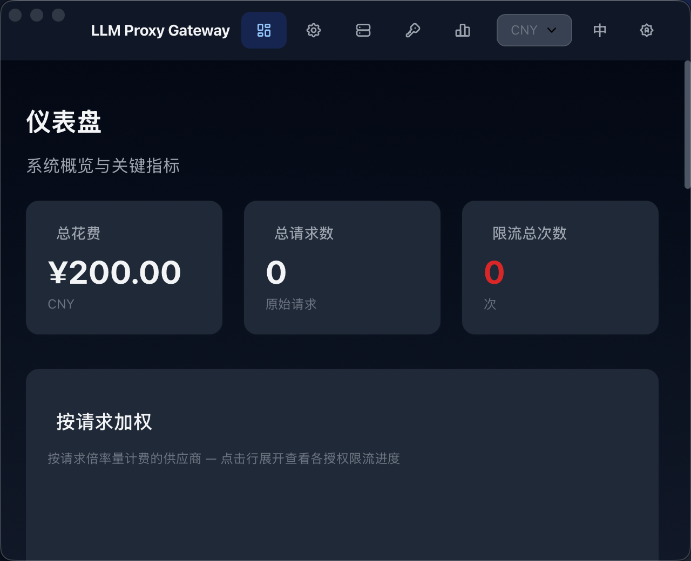
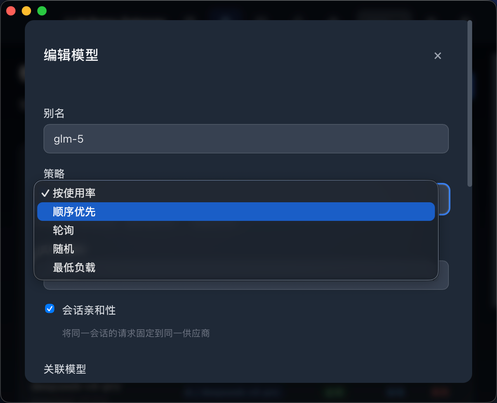
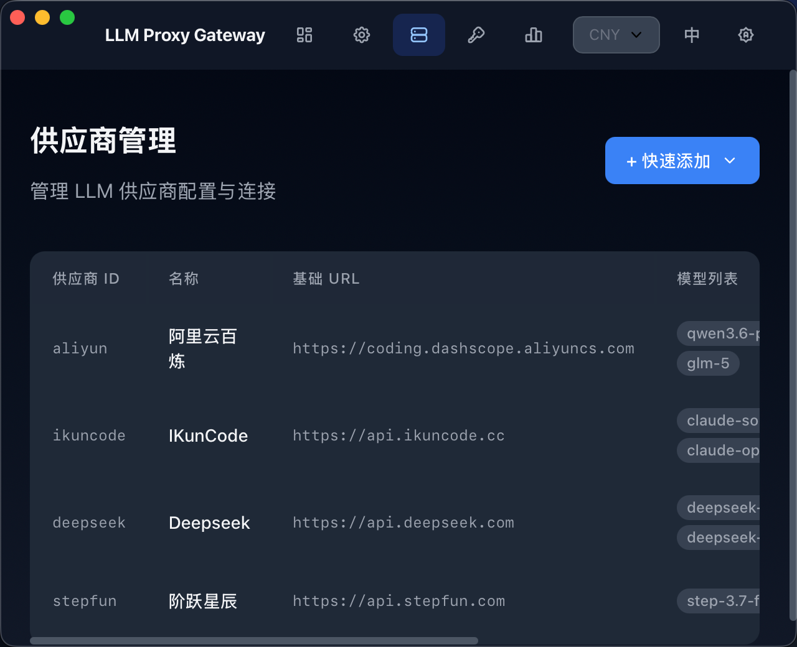
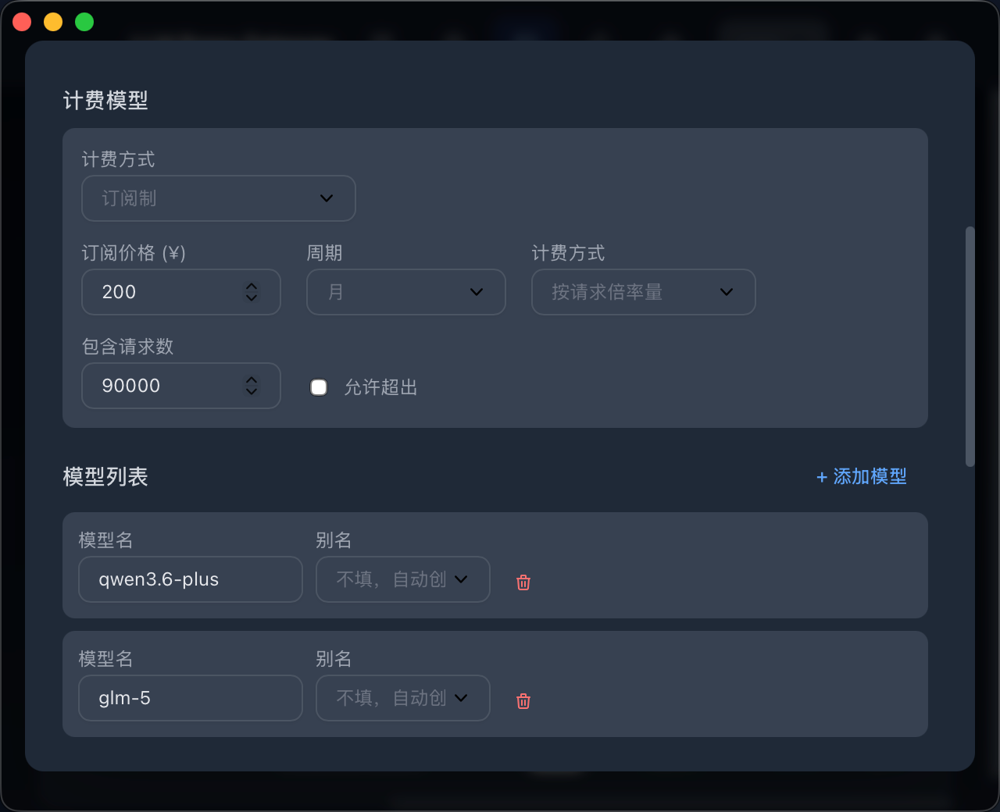
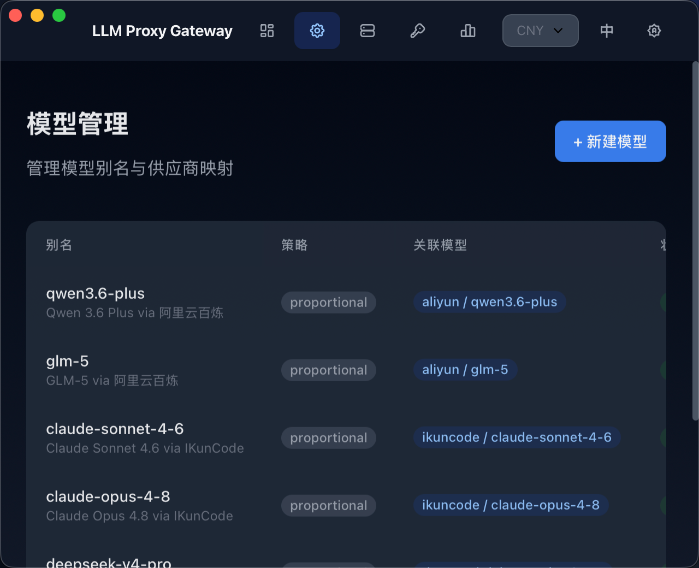
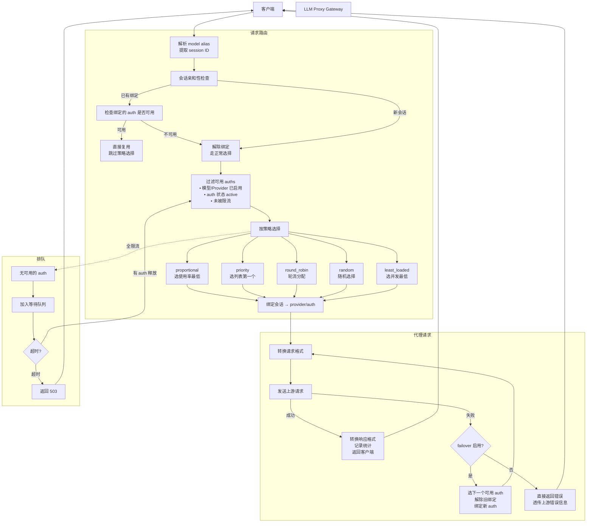

# LLM Proxy Gateway

[](./README.md)

轻量级本地 LLM API 代理网关，聚合多供应商 API，支持模型别名、限流、格式转换、用量统计与计费。



## 功能特性

### 模型别名 + 负载均衡
- 一个模型别名可映射到多个供应商
- 支持 5 种负载均衡策略：按使用率、顺序优先、轮询、随机、最低负载
- 会话亲和性：同一会话的请求固定到同一供应商
- 请求队列：所有授权不可用时排队等待，超时可配



### 多供应商管理
- 支持任意数量供应商，每个供应商可配多个 API Key（授权）
- 供应商配置（模型列表、限流规则、Headers）共享给所有授权
- 负载均衡在授权级别执行



### 供应商级限流（AND 逻辑）
- 限流规则配置在**供应商级别**，判定在**授权级别**
- 支持类型：请求倍率量、并发数、Token 总量
- 多种规则同时生效（AND 逻辑），任一触发即不可用
- 支持周期：秒、分钟、小时、天、每5小时、周、月

### API 格式转换
- 自动检测请求格式：`/chat/completions`、`/messages`、`/responses`
- 全格式互转：chat/completions ↔ messages ↔ responses
- 支持自定义请求头

### 用量统计
- 按次统计：各周期请求次数（授权粒度）
- Token 统计：输入/输出/缓存的时序数据
- 费用汇总：按计费模型分组

### 计费支持
- 四种计费模型：不计费、按请求倍率、按模型 Token、订阅制
- 多货币支持（CNY/USD/EUR 等），实时汇率转换



### 管理界面 — 模型管理



## 快速开始

### 环境要求
- **Node.js** ≥ 18（推荐 v24）
- **Bun**（桌面客户端需要）
- **Yarn**（包管理）

### 安装与运行

```bash
# 克隆项目
git clone https://github.com/harvey-woo/llm-proxy-gateway.git
cd llm-proxy-gateway

# 安装依赖
yarn install

# 复制配置样例
cp config/config.sample.yaml config/config.yaml
# 按需编辑 config/config.yaml

# 运行后端 + 前端开发服务器（Vite HMR）
yarn dev

# 或运行桌面客户端（开发模式）
cd apps/my-gateway-client
bunx electrobun dev
```

打开 http://localhost:9000 访问管理界面。

### 桌面客户端（构建版本）

下载解压后首次打开，终端执行以下命令去除隔离标记，之后即可正常双击打开：

```bash
xattr -d com.apple.quarantine LLM\ Proxy\ Gateway*.app
```

### 配置

参考 `config/config.sample.yaml` 配置供应商和模型别名。API Keys 通过管理界面添加，不存储在配置文件中。

## 请求路由

下图展示客户端请求经过网关代理到上游供应商的完整流程。



### 策略说明

| 策略 | 逻辑 | 适用场景 |
|------|------|---------|
| **proportional** | 选各维度峰值使用率最低的 auth | 默认，通用负载均衡 |
| **priority** | 取可用列表中的第一个 | 主备模式 |
| **round_robin** | 按顺序轮流分配 | 请求均匀分布 |
| **random** | 随机选取 | 简单负载分散 |
| **least_loaded** | 选当前并发数最低的 | 长耗时/流式请求 |

### 会话亲和性 + 错误转移

- **会话亲和性**：同一会话（如 Claude Code 会话）的请求固定到同一个 provider/auth，避免对话上下文分散
- **错误转移**：上游请求失败时自动选择下一个可用 auth 重试（非流式请求），重试成功后重新绑定会话

## 技术栈

| 层 | 技术 |
|---|------|
| **后端** | TypeScript, Hono, Kysely, SQLite |
| **前端** | Vue 3, Reka UI, UnoCSS, Chart.js, vue-i18n |
| **桌面** | Electrobun (macOS), Bun 运行时 |
| **工具** | Yarn Workspaces, Vitest, Playwright, Vite |

## 项目结构

```
llm-proxy-gateway/
├── packages/
│   ├── backend/        # Hono 后端
│   │   ├── src/
│   │   │   ├── routes/     # API 路由
│   │   │   ├── db/         # 数据库层
│   │   │   ├── pool.ts     # 供应商池
│   │   │   ├── rate_limiter.ts
│   │   │   ├── transformer.ts  # 格式转换
│   │   │   └── stats.ts    # 统计收集
│   │   └── test/
│   ├── frontend/       # Vue 3 SPA
│   │   ├── src/
│   │   │   ├── views/       # 页面
│   │   │   ├── components/  # 组件
│   │   │   ├── composables/ # 组合式函数
│   │   │   └── locales/     # 国际化 (zh/en)
│   │   └── test/
│   └── shared/         # 前后端共享类型
├── apps/
│   └── my-gateway-client/   # Electrobun 桌面客户端
├── config/             # YAML 配置
└── docs/
    └── screenshots/    # 截图
```

## 测试

```bash
yarn test          # 运行单元测试（486+ 项）
yarn test:e2e      # 运行 E2E 测试
```

## 许可

MIT
